# Overview

## Background

As the Internet rises, demand for the storage, calculation, and analysis of massive data are becoming more and more common. In all kinds of computer application scenarios, the traditional centralized database is faced with two major problems: theory upgrading and technology upgrading. Since the 21st century, with the rise of large-scale data processing technology represented by Hadoop and its derivative technology, database technology began to move from centralized to distributed compute and storage mode. After more than 10 years of industrial practice, various architectures of distributed transactional database gradually mature.

In recent years, the international information security situation has become increasingly severe, and the national information security strategy has gradually deepened. In order to cope with the severe situation that the core technology is enslaved by foreign countries, the government has successively launched plans to accelerate independence of core technology, so as to build a safe and independent information technology system. However, at present, the core systems of many enterprises still rely on the centralized database products and supporting underlying hardware of foreign IT giants. Lack of breakthrough and independence in the core technology requires urgent innovation of the enterprise\'s information technology and comprehensive improvement of the ability of serving massive users and processing massive data, so as to ensure that the information system is independent, stable and reliable.

## Distributed Relational Database Service

Distributed Relational Database Service, or DRDS, refers to a logically unified database service composed of multiple physically distributed relational data sources connected by computer network. The basic idea of distributed transactional database is to store the data in the original centralized database on multiple data sources, so as to obtain larger storage capacity and higher concurrency access.

# Distributed Transactional Database

## HotDB Server

HotDB Server is a distributed transactional database product of high reliability, high throughput and strong consistency, and focuses on MySQL database service. It provides the operation experience similar to the centralized database for the application in the distributed environment, and supports the business system with massive data, massive users, high concurrency, high availability and high performance. What's more, it has the characteristics of strong transparency, easy expansion and zero learning cost. The data service port of HotDB Server can be accessed like MySQL database, and the data service port of HotDB Server can be connected by application in the same way as MySQL. To replace MySQL with HotDB Server, you only need to modify the host, port, database, user, and password information in the database configuration file of the application. It also supports MySQL database driver and connection pool in different development languages, such as JDBC driver of JAVA, c3p0, DHCP, and DRUID connection pool.

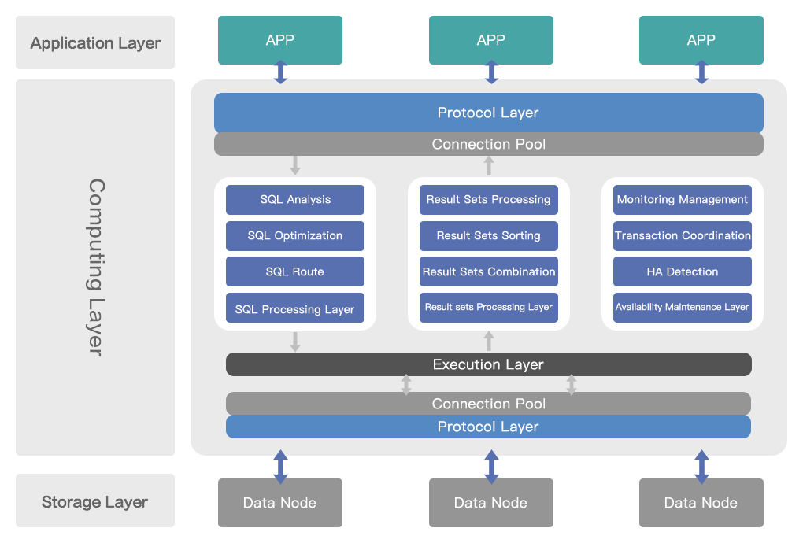

HotDB Server Architecture Diagram

## Cluster Composition Description

The complete distributed transactional database HotDB Server cluster system contains the following components:

**Compute node**: the core of the distributed transactional database HotDB Server cluster system. It undertakes all the work related to database services and serves as the lifeblood of the whole distributed service.

**Management platform**: the distributed transactional database platform, also known as HotDB Management, can realize the easy-to-use configuration of database users, data nodes, table types, sharding rules and other information of compute nodes. Besides, it can provide intelligent operation and maintenance related services such as service status monitoring, exception reminder, report viewing, and task management.

**Data source**: the MySQL database that actually stores business data. A data source can be determined by IP, Prot, and Database. In addition, Data Node, a virtual concept in the HotDB Server cluster system, is used to describe a group of data sources with master-slave relations.

**Management platform ConfigDB**: MySQL database that stores metadata of management platform.

**Compute node ConfigDB**: MySQL database that stores metadata of compute nodes.

**High availability component**: the compute node of HotDB Server can cooperate with Keepalived high availability solution to realize the availability check and high availability switch of the compute node in the active standby mode.

**Load balancing component**: Multiple compute node clusters can choose to use LVS and other methods to distribute SQL requests. The application end can access the compute node service of HotDB Server by VIP of LVS, while ensuring the transparency of use and uninterrupted service. Other load balancing schemes can also be used for processing, such as F5 plus user-defined detection, direct connection between application and compute nodes.

**Backup program**: the distributed transactional database backup program developed by Hotpu technology, used for the backup of business data.

## Features

### Load balancing

- Multi-compute node cluster supports general load balancing solutions for SQL distribution requests.

- Data service of multiple compute nodes in the same cluster is peer-to-peer and support all types of data operations.

- When less than half of the compute nodes in the same cluster fail at the same time, the cluster service is still available; especially, when there are only two compute nodes left after the one-by-one failure of cluster nodes, one of the two compute nodes fails again, and the other node can still provide services.

### High availability

- The compute nodes of HotDB Server support high availability architecture, and clusters with good operation and maintenance management will not cause the overall distributed transactional database service unavailable due to the downtime of the master compute node. And it can be ensured that the total failure time of compute nodes in cluster with good operation and maintenance management in a year is generally no more than 53 minutes.

- The compute node of the cluster with good operation and maintenance management can guarantee that the total failure time in one year generally does not exceed 53 minutes.

- The total time of compute node failure judgment and switch service for clusters with good operation and maintenance management is generally less than 7 seconds, and the best practice is about 5 seconds. The total time of MySQL layer failure judgment and switch service is generally less than 3 seconds.

- HotDB Server supports high availability reconstruction for the compute nodes after failover or manual switch in a visualized way, which reduces the tedious work of manually modifying the failback configuration.

- The data source of HotDB Server supports the native master-slave replication and MGR (MySQL Group Replication) mode of MySQL database.

- In a set of data sources correctly deployed and configured with data node failover rules, when the master data source service is abnormal, the compute node can sense and execute the data source high availability switch in time, and send the new request to the data source after the high availability switch.

- The ConfigDB of HotDB Server supports the native master-slave replication and MGR (MySQL Group Replication) mode of MySQL database.

- In a set of ConfigDB correctly deployed and have replication relations, when the master ConfigDB is abnormal, the compute node can sense and switch to the standby ConfigDB in time.

### High performance

- In the single compute node mode of HotDB Server, when the concurrency number is 256 in the performance test transfer scenario, the compute node throughput can reach 200,000 + TPS and 500,000 + QPS.

- At present, the performance test result of concurrency number is that it can stably support 2048 and above.

- Compared with a single centralized database, the throughput loss of a single compute node of HotDB Server is less than 5%.

- The acquisition performance of global auto-incremental sequence is greater than 200,000 TPS.

Note: The TPS mentioned above is simple TPS. The above performance indicators are based on the following: using the highest configuration hardware specification described in Distributed Transactional Database HotDB Server Hardware Configuration Recommendation; installing and deploying the HotDB Server in a standardized way and perform the tuning described in Performance Test Report For Single Compute Node Basic Scenario of HotDB Server; with no less than 12 data nodes; no performance bottleneck appears in the data source server\\MySQL instance.

### Strong transparency

- HotDB Server provides operation experience similar to centralized database. The application only needs to connect to the data service port of the compute node, and does not need to care about the underlying storage location of the data to operate the business data.

- The amount of code needed to be modified by the application program from the traditional database to the distributed transaction database is generally less than 5%.

- Strong consistent distributed transactions are transparent to the application. No SQL commands or transaction processes need to be changed when users operate. They can be used like ordinary transactions.

- The read-write splitting is transparent to the application. Users do not need to care about the location of distributed SQL. The application program automatically routes the SQL according to the configured read-write splitting strategy.

- The global auto-incremental sequence is transparent to the application. Users can use the HotDB Server global auto incremental sequence just like MySQL auto incremental sequence.

- Support JDBC protocol and MySQL native communication protocol.

### Easy operation and maintenance

- It supports parameter visualization configuration and online verification of parameter rationality.

- It supports immediate effect of dynamic loading after the modification of compute node parameters.

- It supports online upgrade of compute node version.

- It supports multi-thread backup and scheduled automatic backup.

- It supports the monitoring of compute node resources, traffic and server status, and shows the data volume of the cluster, the throughput of compute nodes and data nodes in real time.

- It dynamically draw the topology map of cluster service status, display the running state of compute node and data source in real time, and facilitate the user to locate and repair the abnormality.

- It supports OnlineDDL, so that changes in database table structure do not block online services.

- It supports the elastic expansion of data nodes by online data source migration.

- It supports data consistency detection of master/slave data sources in data nodes, and the detection results can accurately locate inconsistency.

- It supports the consistency detection of global table data, and provides a functional entry to repair inconsistent data.

- It supports the uniqueness detection for the history data of the sharding table creating unique constraints.

- It supports the user password validity detection of compute node and data source, and reminds the user to change the password in time when expiration is detected.

- It supports summary recording of business SQL and automatic analysis of SQL worthy of attention for business level tuning.

- It supports tutorial, which can quickly guide users to the basic configuration of HotDB Server.

- It supports the automatic deployment of compute node clusters in different architecture modes.

- It supports the health examination of cluster operation environment.

- It supports one click collection of cluster operation information to improve the speed and efficiency of cluster troubleshooting.

- It supports visualized display of the business relations between tables based on JOIN SQL logs.

- It supports online updating and activation of the license of compute node through the management platform.

- It supports automatic upgrade of ConfigDB of management platform.

### Safety protection

- It supports overload limit protection mechanism. The protection of compute node and data source can be realized by limiting max connections of the front-end and data source.

- It supports the flow control function. When enabled, the SQL traffic can be intelligently controlled according to the performance of the data source to keep the data source in the best state.

- It supports user privilege control of compute node database, which is 99% compatible with MySQL privilege system.

- It supports the configuration of the IP white list that allows connection to the compute node service. IP addresses outside the white list will be refused to log in when accessing the compute node service.

- It supports cluster abnormality email alarm notification. The management platform includes the operation status of the whole cluster into the monitoring scope. Once the cluster service failure or warning is detected, the program will inform the user by email.

- It supports SQL firewall to intercept high-risk SQL and prevent business system from SQL injection, misoperation or malicious operation.

- It supports the table recycle bin; tables that are dropped or deleted can be retained and restored within the set time range.

- It supports account information encryption management. HotDB Server encrypts and stores account passwords used in all service processes.

- For high-risk operation of some management platforms, HotDB Server provides two-level password verification protection mechanism to prevent misoperation or malicious operation of system data.

- Login authentication API of management platform supports information encryption in transmission.

- It provides encryption and remote storage functions of backup files to ensure data security.

- It provides audit log function, including user operation records of management platform, protection and interception records of compute node, and operation records of management port of compute node.

- It supports the configuration of non-root users with sudo function to connect to the cluster server.

### Expansion capability

- It supports smooth redistribution of table data and smooth migration of data nodes.

- It supports smooth migration of data nodes.

- It supports the increase of read-only data source and the configuration of read-write splitting weight.

- It supports rapid migration of MySQL database to distributed transactional database (extremely short service downtime).

- It supports MySQL versions 5.6, 5.7, and 8.0.

- It supports INFORMATION_SCHEMA database which is similar to MySQL, to facilitate users to query related information about compute node.

### Disaster recovery

- It supports the deployment of cross-IDC DR mode. When the service of the master center fails, the DR center can automatically take over and continue to provide services. It also supports visualized automatic switching to DR center in the case of internal failure of the master center and repair of the original failed master center.

# Function description

## Basic database services

HotDB Server supports MySQL native communication protocol, data definition, data operation, Partition, database management statement, transaction, lock, character set, collations, and other common database basic services. In the data operation, it solves difficulties such as cross-node query and cross-node data sorting, and supports distributed transactions with strong consistency and cross-node deadlock detection.

### Data definition

HotDB Server supports general data definition operation statements, such as CREATE\\DROP\\ALTER\\RENAME\\TRUNCATE. In addition, it supports creating business tables directly by associating with existing sharding rules without defining tables in advance on the management platform.

### Data operation

##### Cross-node SQL

HotDB Server supports cross-node SQL operations, such as:

- Cross-node INNER/LEFT/RIGHT JOIN

- Cross-node combination JOIN and JOIN with brackets

- Cross-node aggregate function

- Cross-node GROUPING+HAVING+SORTING+PAGING

- Cross-node UNION/UNION ALL query

##### Modify sharding key value

HotDB Server allows to update the sharding key value of the sharding table without changing the sharding key value route (that is, the modified sharding key value and the former value are routed to the same data node).

##### Transparent global auto-incremental sequence

Under the distributed architecture, HotDB Server can ensure the global auto-increment of the columns with AUTO_INCREMENT attribute on each data node. The use of transparent global auto-incremental sequence is the same as that of MySQL AUTO_INCREMENT. At present, transparent global auto-incremental sequence can ensure the global orderly increment of this field, but does not guarantee the continuity of the sequence value.

##### Global unique constraint

HotDB Server supports global unique constraints, which can ensure that columns with unique constraints (UNIQUE、PRIMARY KEY) are global unique on all data nodes when this function is enabled. If the related functions are enabled, it can also locate a single node when the SELECT query statement does not contain sharding keys but contains unique constraint fields. Currently, it supports setting global unique constraints to the table level.

### PARTITION

HotDB Server supports operations related to PARTITION in database, such as CREATE PARTITION TABLE, ALTER PARTITION, INSERT PARTITION, UPDATE PARTITION, SELECT PARTITION, and DELETE PARTITION.

### Data management statement

HotDB Server supports database management statements, such as SHOW, DESC, USE, KILL and some session level SET statements.

### Trigger

HotDB Server supports trigger function in a single node environment and supports the backup and restore of triggers.

### Subquery

HotDB Server supports the subquery function in some scenarios.

### Transactions and locks

##### Transactions

- It supports both explicit and implicit distributed transactions.

- It supports both distributed transactions with weak consistency and strong consistency.

- It supports session-level transactional isolation levels: READ COMMITE, REPEATABLE READ, and SERIALIZABLE.

- It supports defining SAVEPOINT and setting transaction commit rollback attributes, such as COMMIT \[WORK\] \[AND \[NO\] CHAIN\] \[\[NO\] RELEASE\] and ROLLBACK \[WORK\] \[AND \[NO\] CHAIN\] \[\[NO\] RELEASE\].

##### Distributed transactions with Strong consistency(XA)

HotDB Server uses the external XA transaction provided by MySQL not only to solve the problem of strong data consistency in cross-datanode transaction scenarios, either through committing or through rollbacking transactions of all data nodes, but also support isolation levels of REPEATABLE READ and SERIALIZABLE which have the same function performance as that of single MySQL. With XA transaction function enabled, no change is required in the SQL command and transaction process, which can be used like a normal transaction.

##### Cross-node deadlock detection

In the distributed transactional database system, cross-instance deadlock, which occurs between two nodes, cannot be detected by the deadlock detection mechanism of MySQL. In the HotDB Server distributed transactional database system, HotDB Server cross-node deadlock detection can detect multiple cross-node deadlocks and rollback the transaction with the least overhead.

### Character sets and collations

- HotDB Server supports common character sets, such as utf8, gbk, latin1, and utf8mb4.

- HotDB Server supports common collations, such as utf8_general_ci, utf8_bin, latin1_swedish_ci, latin1_bin, gbk_chinese_ci, gbk_bin, utf8mb4_general_ci, and utf8mb4_bin.

### User privilege system

HotDB Server is compatible with MySQL user privilege system, and supports multi-dimensional configuration such as global privilege, LogicDB privilege, and table privilege. In addition, the user Table Privilege Denied function is added to the HotDB Server user system, which facilitates users to quickly configure a set of privilege system with high security for the business system. At present, the configuration of user privilege can be operated through the management platform.

### Sharding algorithms

HotDB Server provides seven data sharding algorithms to meet the sharding requirements of most scenarios of users. Detailed descriptions of the seven sharding algorithms are as follow:

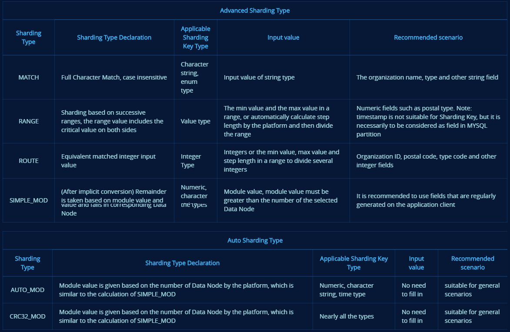

### Types of table

HotDB Server provides four types of table for users to choose. Users can choose the appropriate types of database table based on the actual business scenarios. Detailed descriptions of the four table types are as follow:

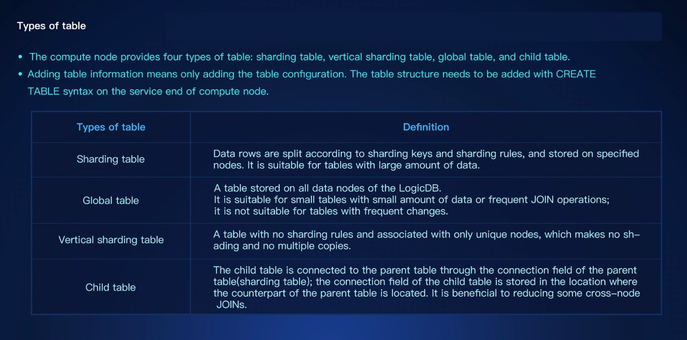

### Compatible with Oracle function and Sequence syntax

HotDB Server provides the compatibility function for some common Oracle functions and Sequence syntax. When users migrate from Oracle to HotDB Server, the amount of business code modification can be reduced.

## High availability of data services

HotDB Server provides a comprehensive high availability guarantee at the compute node, data node, ConfigDB and other levels. It provides perfect heartbeat detection, data catch-up of data sources in case of failover, automatic number skipping of global auto-incremental sequence in case of failure, client connection Hold and other mechanisms to ensure the availability of data services and data consistency.

### High availability of compute node services

HotDB Server uses keepalived to realize high availability of compute node services. The health state of the compute node is detected in real time by keepalived and the high availability switch is executed when the compute node fails. At present, it supports manual high availability switch of the compute node cluster in the active/standby mode through the management platform. It can also reconstruct the high availability environment after the high availability switch of the compute node cluster, so as to ensure the normal switch in the next failure.

### High availability of data node services

HotDB Server provides high availability of data sources within data nodes. In a set of data sources properly deployed and have failover rules configured, when the active data source is unavailable, the program will automatically switch to the standby data source with the highest priority, and ensure the data catch-up of the active/standby. Requirements for high availability of data nodes: the failover rules of the active/standby data sources must be configured, and the heartbeat function must be enabled in the compute nodes.

### High availability of ConfigDB services

HotDB Server supports high availability of ConfigDB services to prevent the compute node from providing services abnormally when the ConfigDB instance fails. The ConfigDB currently supports three replication modes: master-slave, master-master, and MGR (MySQL Group Replication).

### Data synchronization

##### Normal replication mode

HotDB Server supports MySQL Replication for ConfigDB and data sources. It supports MIXED and ROW as BINLOG format, and supports semi-synchronous replication, GTID, multi-thread replication.

##### MGR real time synchronization

HotDB Server supports MGR(MySQL Group Replication) mode for ConfigDB and data sources. Currently, only single primary mode is supported. Compared with semi-synchronous replication, it can slightly improve the master-slave data consistency in the failure scenario (semi-synchronous replication can ensure that the transaction that receives the commit ok is not lost, but does not guarantee the master-slave data consistency after the master performs the crash recovery process).

##### Multi-source replication

Multi-source replication is compatible with HotDB Server, but does not support data sources.

### Data catch-up

In the high availability of data sources in the distributed transactional database, when the master data source goes down, the compute node will execute switch according to the priority of slave data source, and ensure that the service is switched to the slave data source only after the available slave data sources catch up with all applicable relaylogs. Combined with semi-synchronous replication, it can ensure that \"the transaction that has received the commit ok will not be lost, and the transaction that has not issued commit will be rolled back\"; on this basis, by enabling the strong consistency mode of HotDB Server, it can additionally guarantee that \"the transaction that has issued commit but has not received commit ok will be all committed or rolled back\".

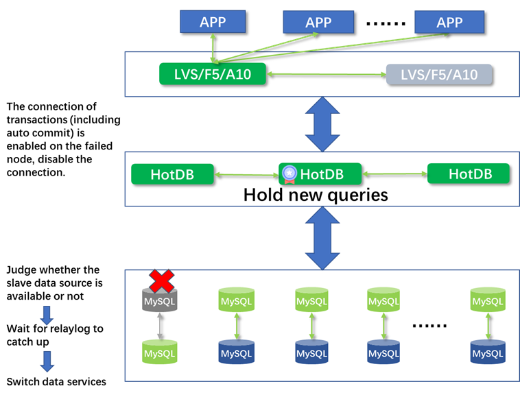

Data source failover process diagram

## Database operation and maintenance management

HotDB Server provides intelligent operation and maintenance services in multiple aspects such as parameter configuration, service monitoring, data detection, security, and alarm.

### Master/slave data consistency detection

The management platform provides the master/slave data consistency detection for the LogicDB, data sources and ConfigDB. The master/slave data consistency detection can detect whether the table structure and table data between the master and slave data sources are consistent. When a small number of data inconsistencies are detected, the master/slave data consistency detection can locate the primary key value of inconsistent data rows; when there is a large number of inconsistencies, the inconsistent primary key value range or the prompt of a large number of inconsistencies in the whole table will be displayed. In addition, you can add a schedule to regularly detect the data consistency in the selected LogicDB.

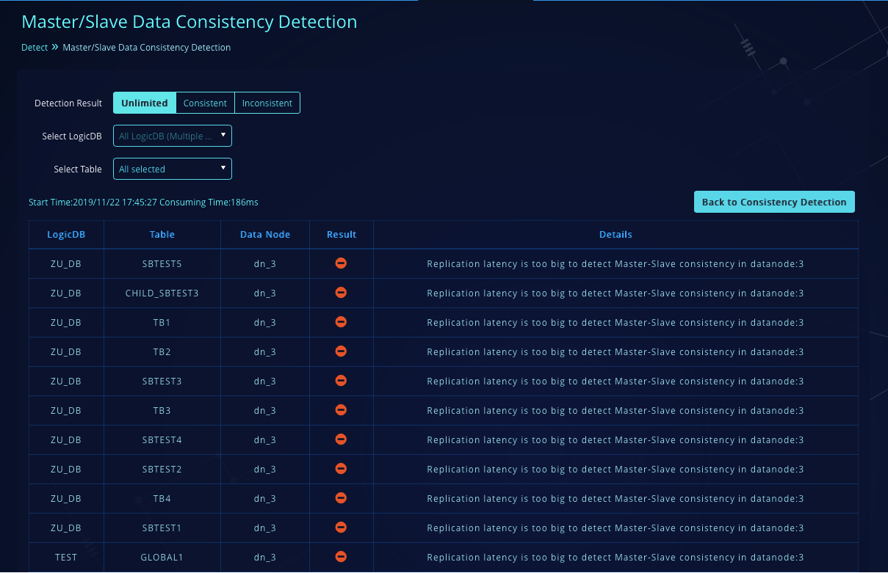

### Global table data detection

The management platform provides the function of global table data detection. You can select a global table in a specific LogicDB and detect whether the data in the table is consistent in all data nodes. If there is inconsistent data, data can be repaired through the repair function. In addition, the consistency of global table data can be detected regularly by adding a regular detection plan. If an exception is found in the detection, the user will be informed in the event notification.

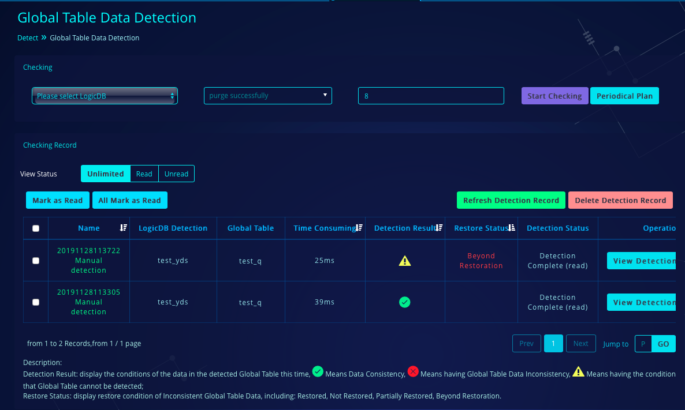

### Sharding route detection

HotDB Server supports route detection of historical data in sharding table, which can detect whether the business data is correctly routed according to the configured sharding rules, and can also check whether the sharding data imported from other distributed transactional database systems to HotDB Server has the problem of routing errors.

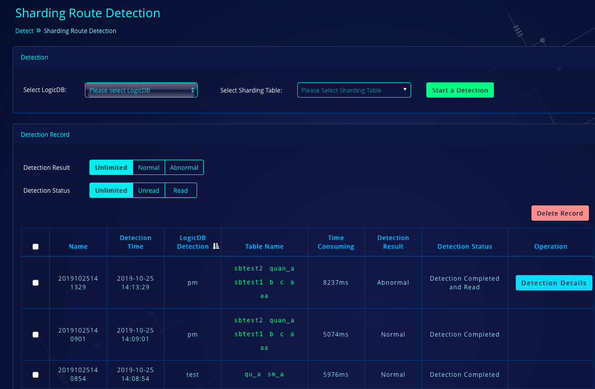

### Data unique constraint detection

HotDB Server supports data unique constraint detection on sharding tables or sub tables. It can discover in time whether the history data of the tables with unique constraints enabled in the cluster is not unique. The duplicate data of the table which violates the unique constraint is visualized and displayed, which facilitates users to repair.

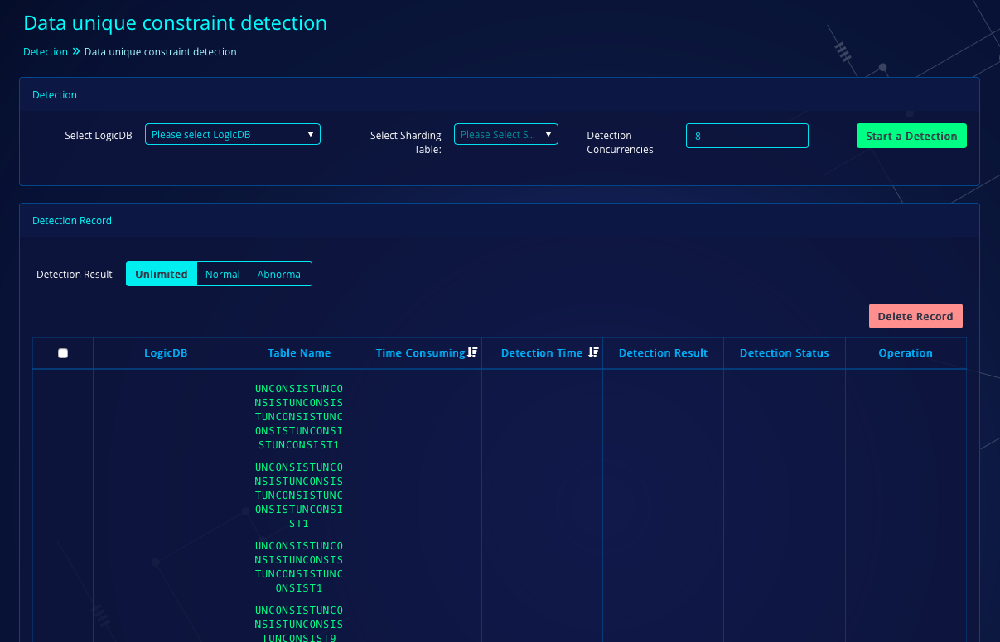

### Sharding plan recommendation

HotDB Server supports sharding plan calculation and recommendation based on SQL logs generated by simulated pressure measurement to help users find appropriate table sharding keys through actual business scenarios. Combined with a small amount of manual optimization, such as changing sharding algorithm, business table sharding plan suitable for the production environment can be generated eventually.

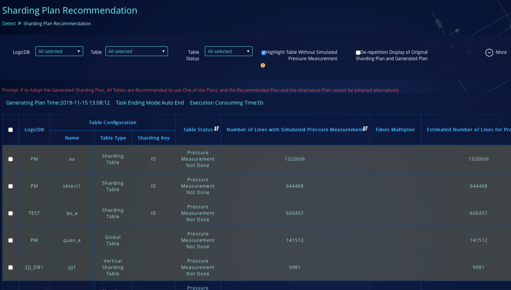

### Sharding plan online modification

It provides online modification support for four dimensions of business table, namely table types, sharding rules, sharding keys and data node to which the sharding belongs. At the same time, single or batch table modification can be performed in combination with the sharding plan recommendation results. In addition, it supports setting data replication pause period when business table modifications are made to avoid business peak and reduce the impact on system performance.

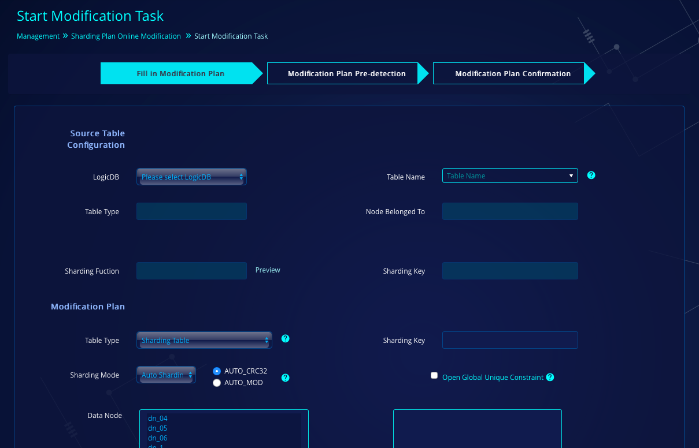

### Table structure modification

##### Regular DDL

The management platform supports the execution of Regular DDL and the creation and modification of database tables. At the same time, for sensitive operations, such as \"drop, truncate\" and other SQL, the second password verification is carried out to prevent misoperation and malicious operation.

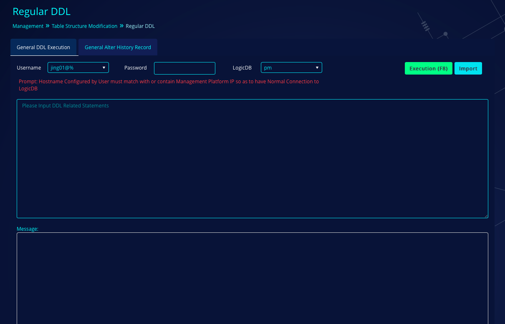

##### Online DDL

The management platform supports the execution of Online DDL to ensure that online business reading and writing will not be blocked when table modifications are made. And all the records of modification in progress or completed can be viewed on the online modification detection page.

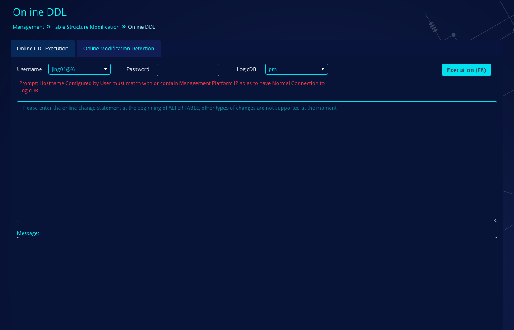

### View SQL routing plan

HotDB Server provides SQL routing plan view function. You can view the routing plan of the executed SQL statement, displays the specific data nodes distributed after the routing analysis of the compute node, and provides the user with the SQL distribution prediction information.

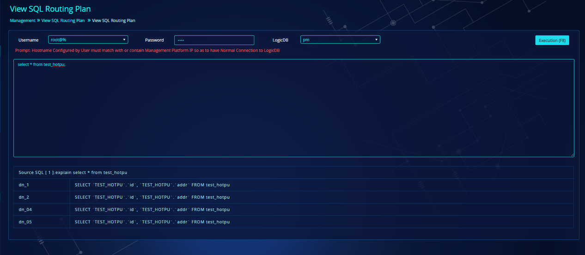

### Config checking

HotDB Server supports one key detection of currently configured data nodes, data sources, LogicDBs, sharding rules, database users and other information. If there is an exception or error, it will prompt the error message and locate the specific error source.

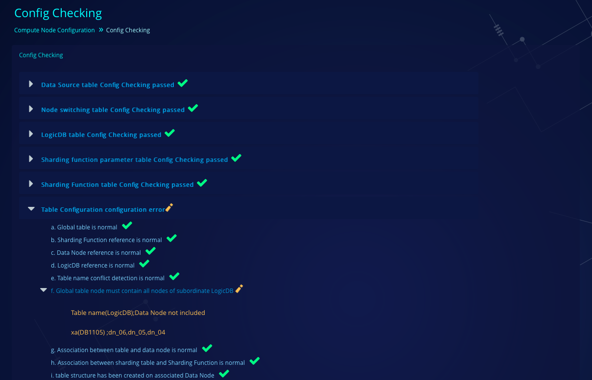

### Multi-cluster service management

The management platform supports the management of multiple sets of compute node clusters. After logging in to the management platform, users can select specific clusters on the \"compute node selection\" page to enter the management. At the same time, the \"compute node selection\" page supports real-time display of the running status of all compute node instances in the cluster and all instances in the ConfigDB.

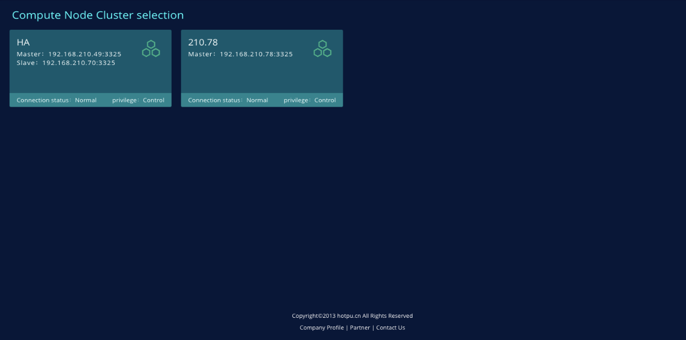

### Logic topological graph

- The management platform dynamically generates: number of connections and QPS for each application client; replication status, data capacity, connections and QPS for each data node; replication latency, connections and QPS for each data source; connections, QPS for each LogicDB and status value of each parameter for each compute node based on the information of application connection pool and database connection pool. This information is shown in the topology map.

- The user can set the alarm threshold for the objects monitored in the topology map. When the threshold value is reached, the icon will alarm the system of the exception with flash and color change (yellow for warning, red for alarm). Users can understand the cause of the alarm by hovering over the icon of the specific alarm to help users quickly and accurately locate the problem.

- The topological graph supports recording and displaying INFO, WARNIN, ERROR information generated by front-end applications, compute nodes and data sources.

- It supports topological graph switching between 2D and 2.5D.

- The users can execute manual high availability switch to the data nodes with master-slave or master-master replication relations through the topological graph, or copy the database connection information of each data source.

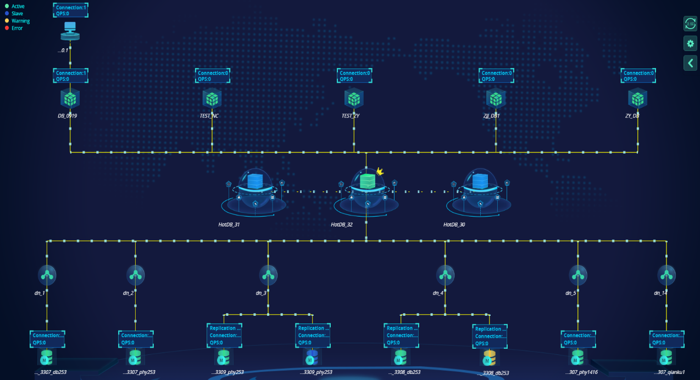

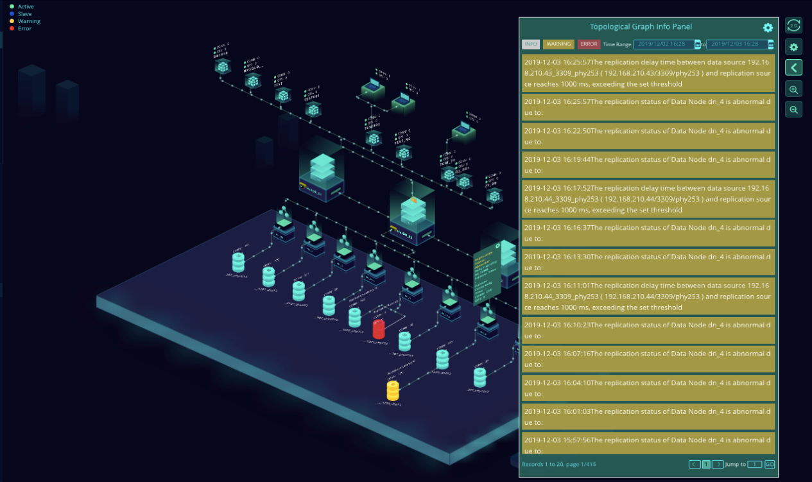

### Physical topological graph

Physical topological graph mainly displays the relation between cluster components and servers from the perspective of server. At the same time, the usage of server resources and the running status of cluster component services can be viewed. Before using, it is necessary to configure the available SSH connection information for the server. Otherwise, only the relation between the server and the cluster component can be viewed, and the status of the server resources used and the component program cannot be viewed.

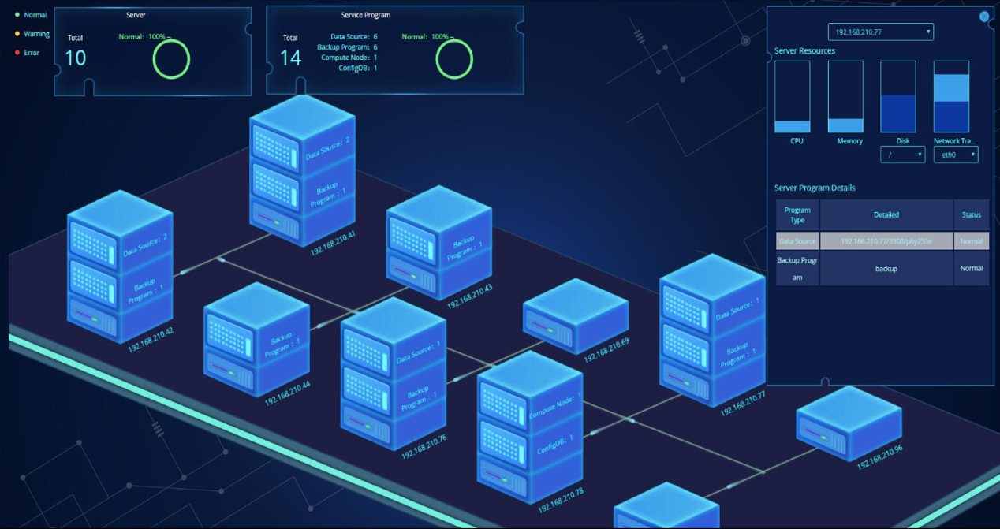

### Monitoring panel

The management platform supports monitoring of compute node service status, compute node throughput, and compute node server resources.

- Monitoring of compute node service status: total number of client connections, usage of compute node threads, backend connection status, usage rate of compute node direct memory, real-time data volume, and usage rate of compute node heap memory.

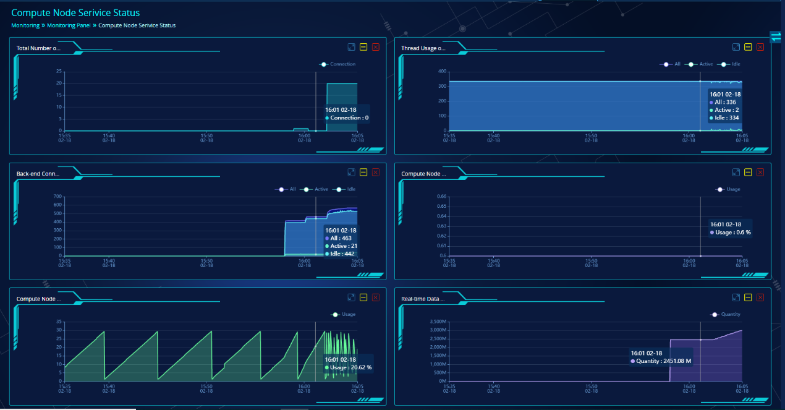

- Compute node throughput: network traffic monitoring, TPS, QPS, client operation rate, back-end operation rate.

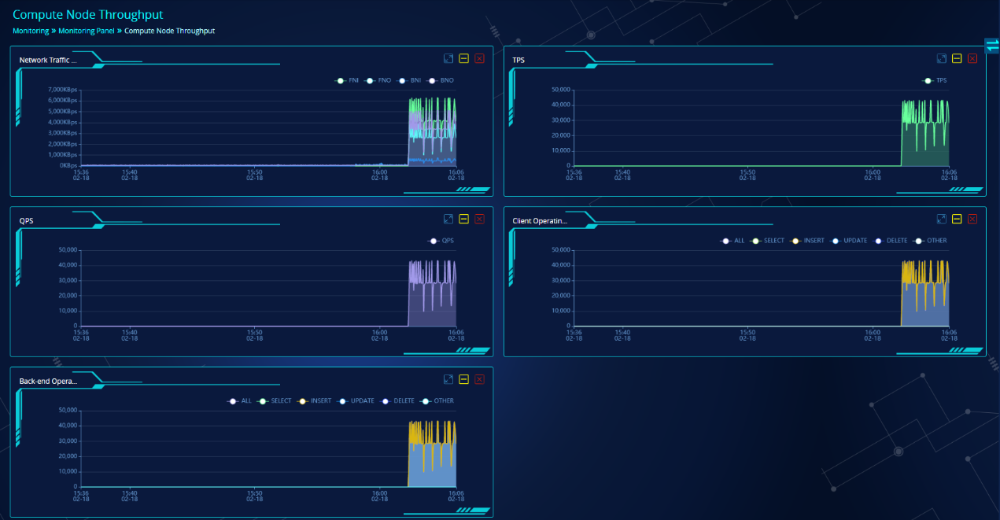

- Compute node server resources: server memory usage, server disk space usage, server CPU load, server CPU usage, server disk read/write, server network traffic in/out, and server disk IO bandwidth utilization.

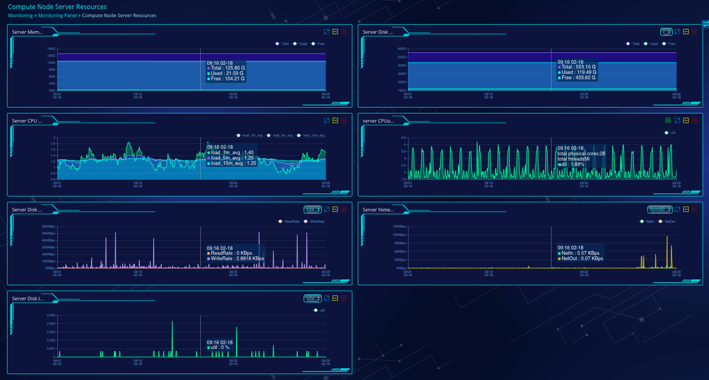

- Cluster resources monitoring: including data sources and other servers with SSH access privileges. Monitoring items include: CPU usage, memory usage, disk usage, network traffic in/out. Alert the server that exceeds the configured monitoring threshold and display the failure of the server that cannot be connected.

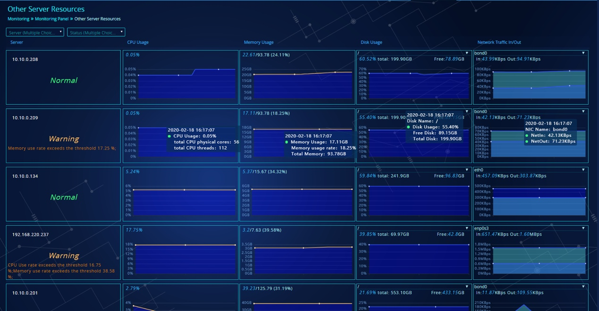

- Data increment prediction: data capacity of data source/ ConfigDB can be planned in advance according to history data amount.

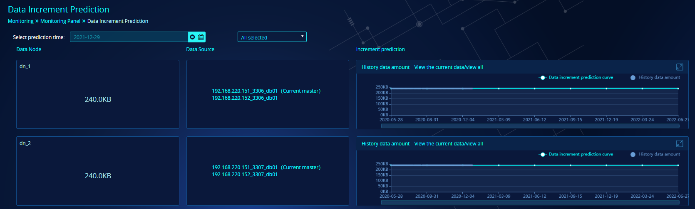

### JOIN correlation analysis

Based on the SQL logs recorded by the compute node, the management platform uses the SQL logs in line with the JOIN query scenario to visualize the relations between business tables. Through graphical display, users can quickly locate the tables with high frequency JOIN in the business, and locate the SQL with cross JOIN Correlation over cross-modes for various reasons. It provides reliable basis for users to adjust sharding rules and optimize JOIN query SQL and improve system performance.

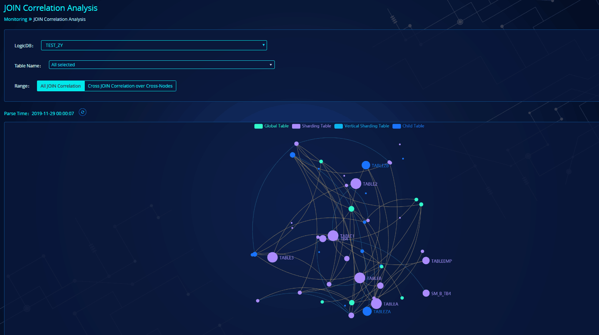

### Report

It supports report display of cluster data volume, compute node throughput, data node throughput, and compute node connection information. The presentation can be graphic mode or table mode, and the report data can be directly exported to the local.

- Cluster data volume report: trend chart of cluster data volume change, distribution chart of cluster data volume, distribution chart of LogicDB data volume, distribution chart of table data volume.

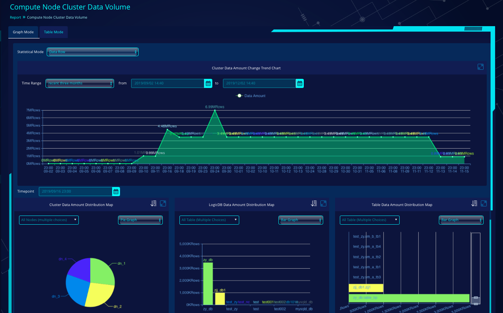

- Compute node throughput report: compute node throughput change trend chart, compute node throughput type comparison chart, LogicDB throughput comparison chart, table throughput comparison chart.

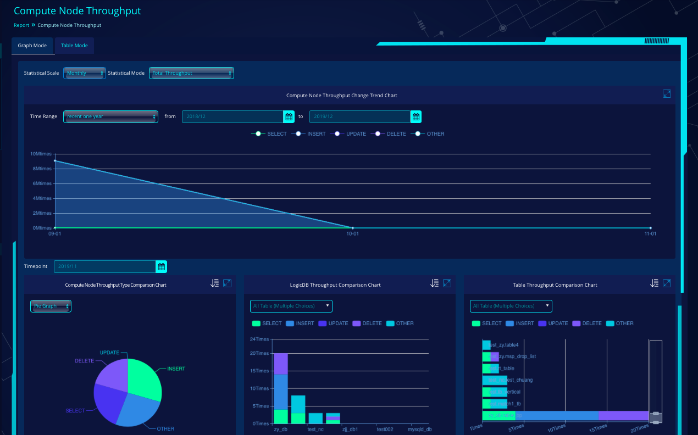

- Data node throughput report: comparison chart of total throughput of data nodes, trend chart of throughput change of data nodes, comparison chart of cluster throughput types, comparison chart of LogicDB throughput, and comparison chart of table throughput.

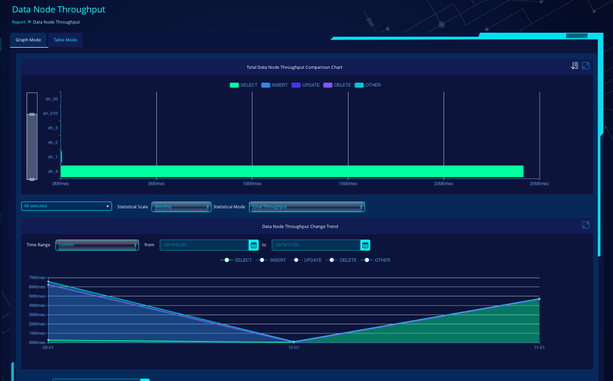

- Compute node connection report: total connections, the connection with the longest connection time, the connection with the most operation times, the connection with the most connection times, the proportion of total connection time, the proportion of total connection times, the proportion of operation times, the distribution diagram of front-end application IP connection, the distribution diagram of connection users, and the distribution diagram of LogicDB.

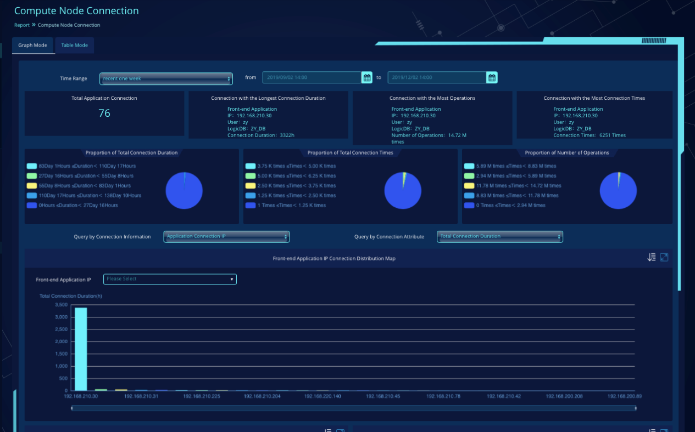

### Table structure＆index detection

The management platform supports LogicDB detection of whether the table structure and index definition of tables under multiple data nodes are consistent. The reason for inconsistency will be displayed in the detection results once inconsistency is detected. In addition, you can add a scheduled task to monitor the status of the business table, and the system will immediately alert the user in the event notification if there is any definition exception in the table structure or index, so as to help the user find the table in question in time.

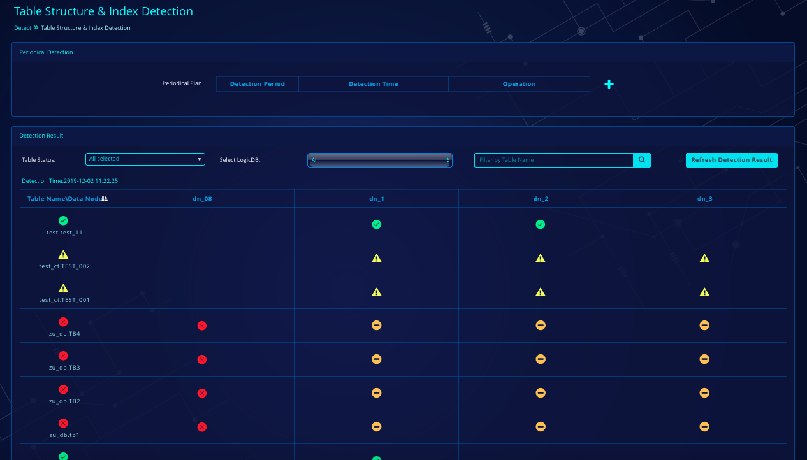

### Audit logs

The management platform supports audit records of user operations, including: basic operation of management platform, security operation, management port command operation, etc. It is helpful for troubleshooting and analysis when the system is abnormal.

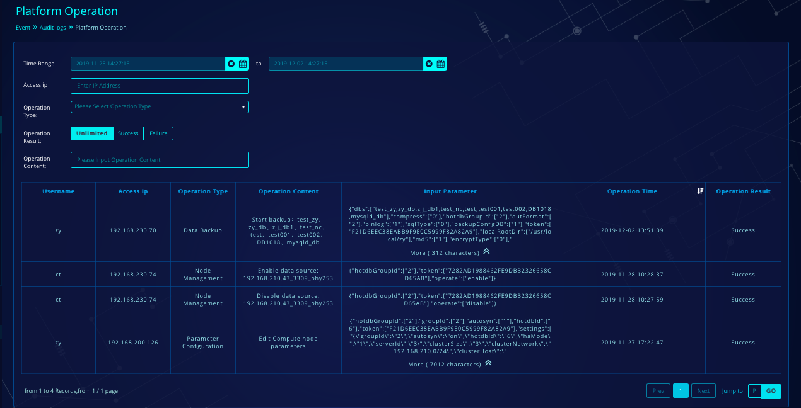

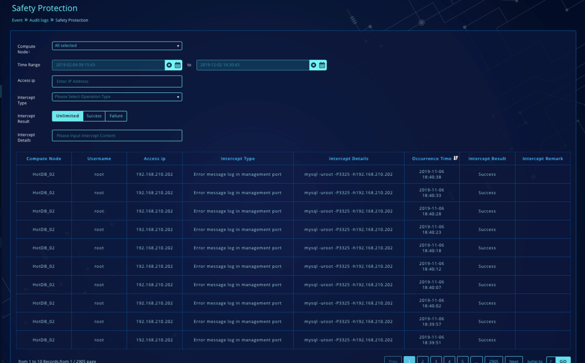

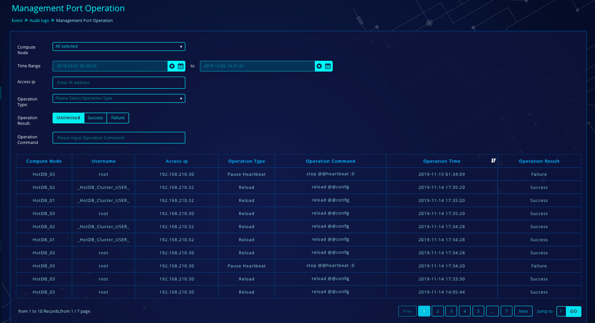

### Slow Query Log Analysis

HotDB Management provides the Slow Query Log Analysis function to account details of execution time consuming and execution times of SQL statements such as select, insert, update, delete, transaction open, submission, and rollback. The internal algorithm is used to automatically analyze the SQL statement that needs to be optimized and assist users to optimize business SQL through the To-Be-Optimized mark and SQL optimization suggestions. Users can also query the page statistics to obtain the actual SQL execution condition and SQL statements to be optimized to help improve system performance.

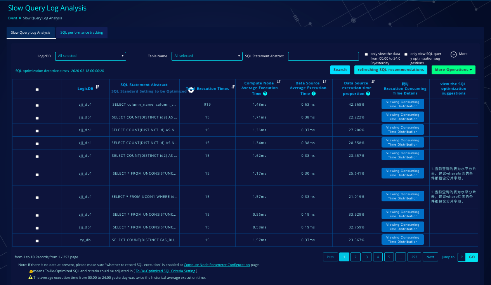

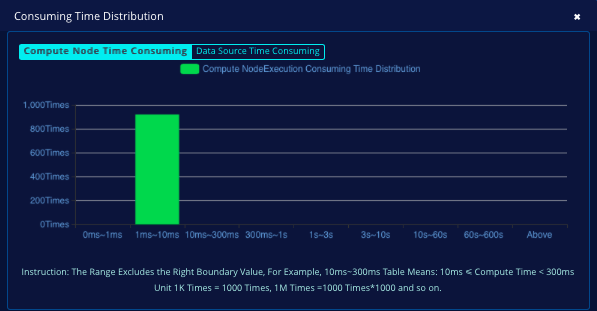

### Business data reporting

Business data reporting can summarize and report the key data of annual cluster running status to let users understand the cluster running status.

### History events and compute node logs

##### History events

It mainly records server time difference, parameter awareness, data sources being shared, master/slave data consistency detection, data source migration, global table data detection, table structure and table index detection, backup failure caused by configuration modification, global unique constraint exception and other related event information. Different alarm levels corresponding to different event information include ERROR, WARNING, INFO, UNKNOW.

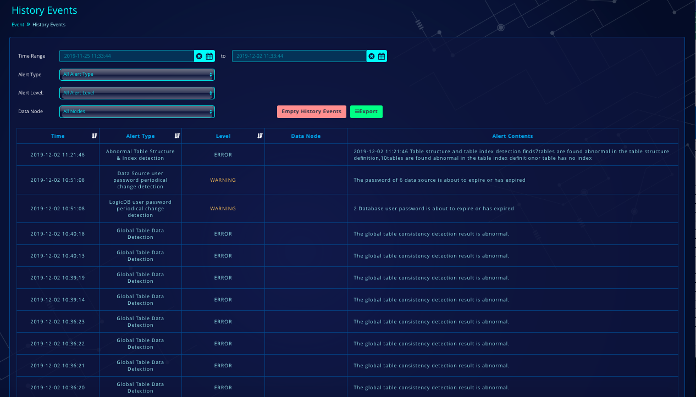

##### Compute node logs

It mainly provides the log information generated during the operation of the compute node. By default, the management platform only obtains the log information of ERROR level in the compute node (you can customize the log level). You can filter log information by time range, log type, log level, view status, and log content. Multi-node mode cluster can support viewing log information on multiple compute nodes. At the same time, it supports exporting log files to local.

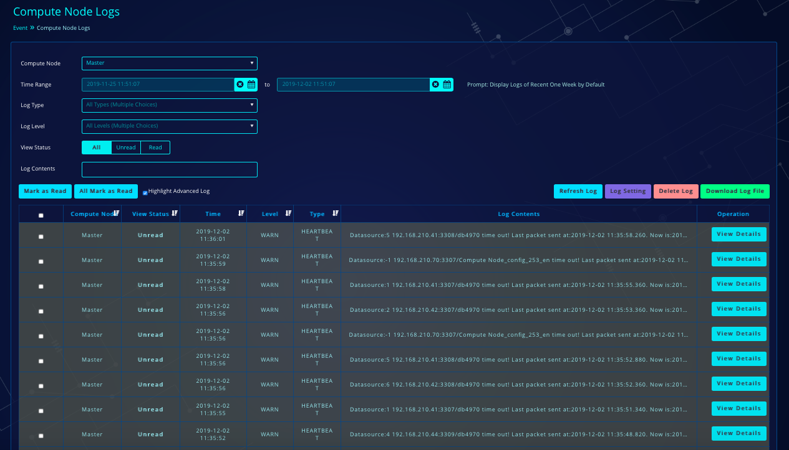

### Sharding grade

The management platform provides a reasonable score for the sharding plan of the created sharding table, and displays the score of the business table in each dimension in the current sharding plan to help users to find unreasonably split tables in time.

**Five dimensions:**

- **Score of well-distributed data amount**

Calculate the score according to whether the data distribution of each node is uniform and whether the growth is uniform

- **Score of cross-node transaction proportion**

Calculate the score based on the proportion of cross-node transaction queries

- **Score of SELECT operations**

Calculate the score according to whether the total queries of each node is uniform, the proportion of cross-node join queries, the proportion of single-node queries, and the proportion of queries that are routed to all nodes because they cannot be routed to the specified node.

- **Score of IUD operations**

Calculate the score according to whether the IUD operation of each node is uniform and the single-node IUD operation proportion

- **Score of other dimensions**

Calculate the score according to the number of times the query cannot find the node and whether the sharding key definition is reasonable.

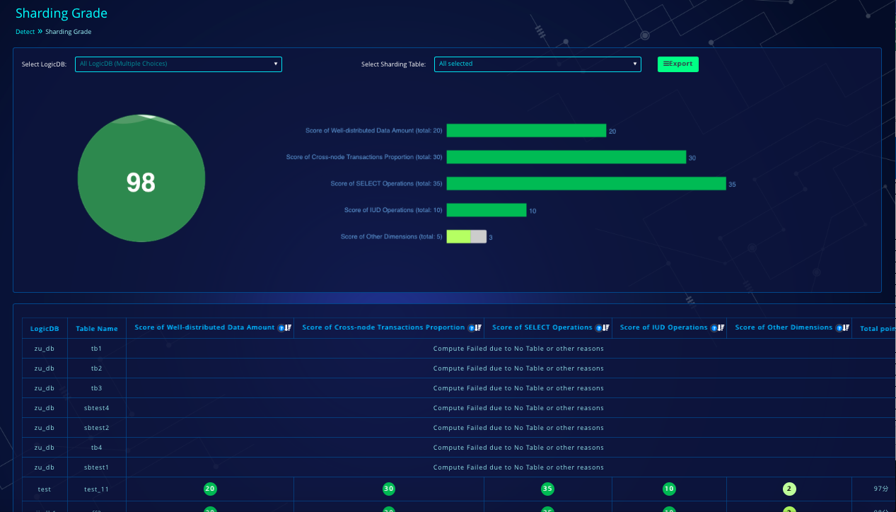

### Email sender setting

After configuring outbox parameters, add information about email receiver and check the monitoring item through the management platform, you can use the email sender function. At present, the monitoring scope includes: failure or switch between compute node and data source, resource status of compute node server, service status of compute node, related detection of data source, system timing task detection, license authorization monitoring. If the local cannot receive email normally, the content of the alarm log can also be output to the local text.

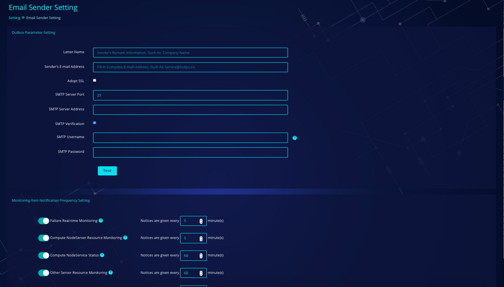

### Multi-thread backup

HotDB Server provides HotDB Backup, a multi-thread backup tool similar to Mydumper.

Features:

- It ensures that the global time point and data status of the distributed transactional database are consistent.

- During the backup period, there is no blocking for online business.

- The incremental backup automatically follows the full backup.

- LogicDB backup and table backup are executed in parallel.

- You can manually cancel the backup task in progress during backup.

- You can add a backup plan to back up business data regularly, or you can manually delay the time of next backup task or set a time point within the scheduled plan not to back up.

- The data backup is supported to be restored a specified time point in XA (strong consistency) mode.

- In addition, HotDB Backup also supports functions such as encrypting backup files, calculating file MD5 values, and backing up to remote.

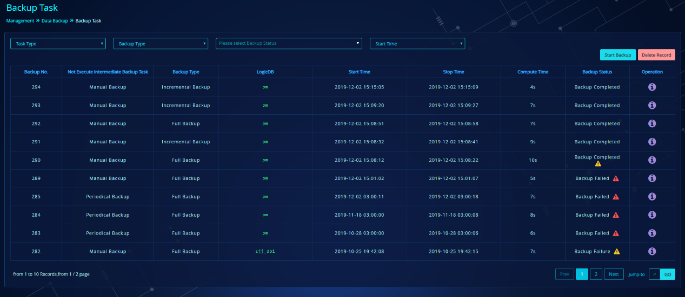

Here is a comparison chart between HotDB Backup and several traditional backup tools:

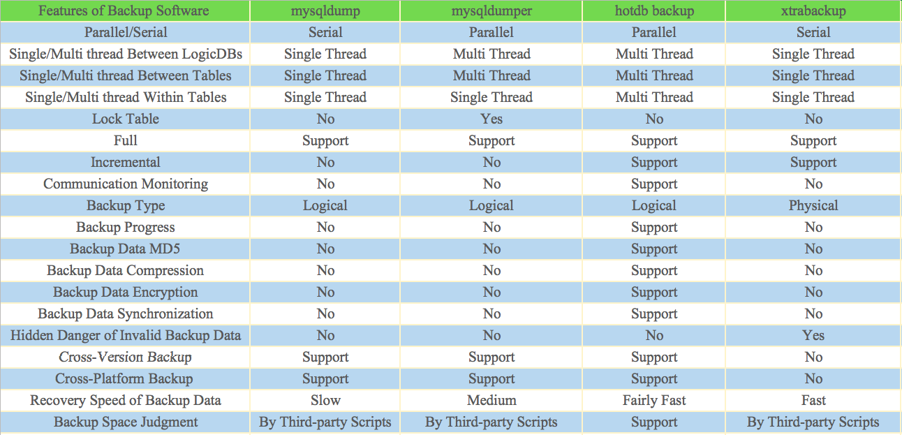

### Data restore

HotDB Server supports data restore request in the interface after data backup. The backup data can be restored according to the recovery time point to ensure data integrity. The data restore automatically brings out the full backup and incremental backup files available for the selected time point. SQL execution errors during rec restore overy can be viewed in the interface detailed log.

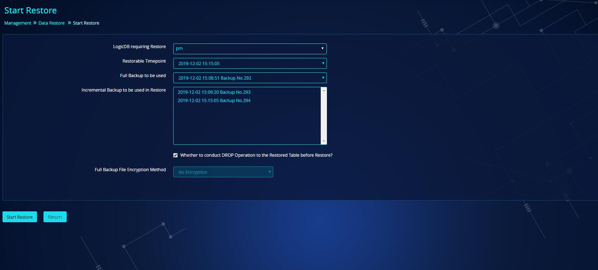

### SQL firewall and white list

Users can set SQL firewall to intercept suspicious operations, such as \"DELETE without WHERE condition, and UPDATE without WHERE condition.\"; they can also set IP access white list to limit the range of IP addresses allowed to connect to HotDB Server service.

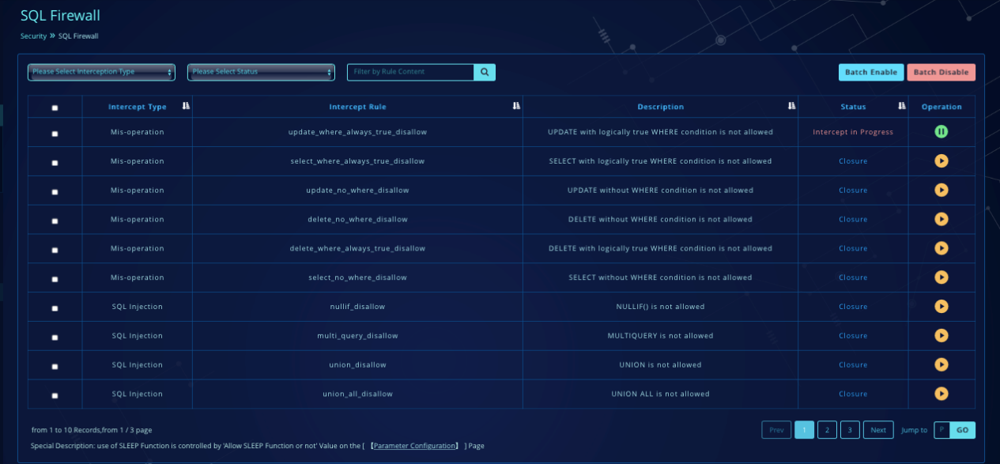

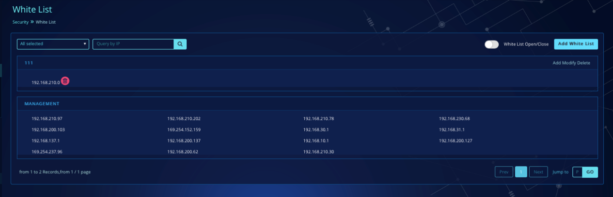

### Data source migration

HotDB Server supports online data source migration. When the hardware configuration of the server where the data source is located is insufficient or the MySQL version needs to be shut down and upgraded, the data of the data source can be migrated to the new data source server through the data source migration function. In essence, data source migration is to replace the data sources under the data nodes with other data sources that have MySQL replication relations and have the same data.

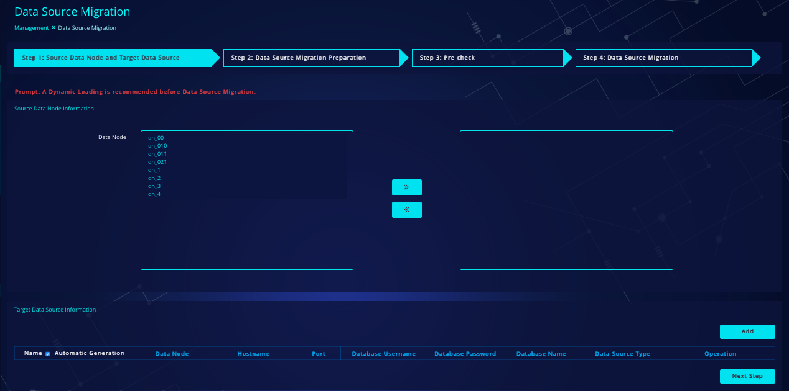

### Overload protection/current limits

##### Front-end connection limit

HotDB Server supports limiting the total connections of front-end and user connections. When the connection exceeds the limit, the front-end connection will be rejected and an error message will be given.

##### Data source connection limit

HotDB Server supports limiting the max connections of data sources to protect data sources.

##### Intelligent flow control of data source

HotDB Server supports intelligent flow control of all kinds of SQL statements executed at the back-end. According to the performance of data sources, SQL traffic can be intelligently controlled and adjusted to keep the data sources in the best state and prevent a certain data source from downtime due to too much concurrency pressure.

### Monitoring management

The management platform supports the execution of management commands in the management port (default 3325) of some compute nodes through the interface. For example, you can check the connection status of the front and back end of the compute node, the connection information of the current session, the running status of SQL, and the thread resources of the compute node. It facilitates users to troubleshoot problems and quickly solve system faults or hidden dangers.

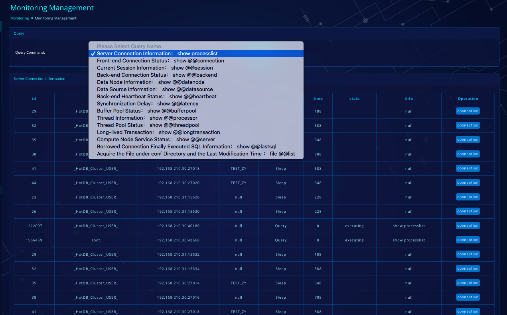

### Hot reload of configuration parameter

HotDB Server supports the hot reload of configuration parameters. When updating the configuration of compute nodes, data sources, LogicDB, table information, sharding rules, etc., the management platform will prompt and guide the user to click the dynamic loading to update the configuration information in the memory of compute nodes in time on the page. Users can directly load parameters to the compute node by clicking the page button without restarting the compute node service.

### User privilege management

##### Management platform users

Management platform users, users of the distributed transactional database platform, are divided into manager users and general users.

- **Manager users**

Manager users can add general users for the management platform and deploy compute node clusters. Moreover, manager users can manage the authorized compute node cluster, and support to switch the perspective of manager user role and general user role in the user information of management platform.

- **General users**

General users are the users who actually manage the compute node cluster and have access or control privileges to the authorized compute node cluster.

##### LogicDB users

LogicDB users are the users who access the compute node service. HotDB Server\'s user privilege system is compatible with MySQL and provides multi-dimensional configuration of global privilege, LogicDB privilege, and table privilege. Besides, the table denied privilege is added to facilitate the manager user to quickly isolate users from operating the business tables with higher security level.

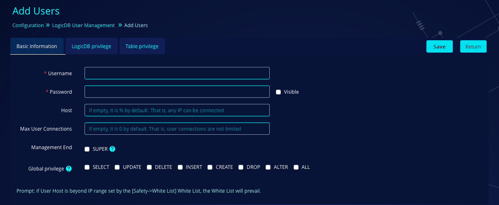

### High availability environment switch and reconstruction

HotDB Server supports visualized manual high availability switch for the compute node cluster in active/standby mode through the management platform. It can also reconstruct the high availability environment after the high availability switch (manual or failover) of the compute node, so as to ensure the normal switch of the program in the next failure of the active compute node.

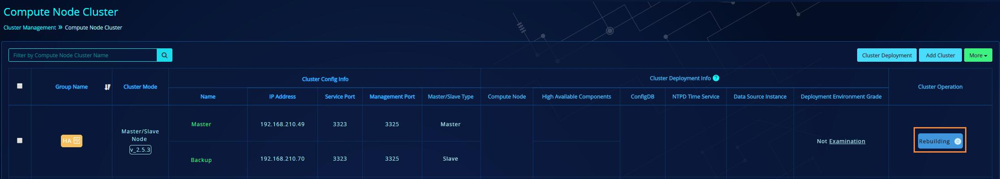

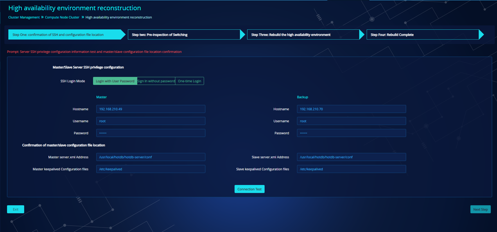

### Installation and deployment

##### Cluster deployment

Cluster deployment function is an overall solution for rapid deployment of the distributed transactional database cluster, which supports rapid deployment of single compute node, active/standby compute nodes, and multiple compute nodes. It can install the components required by the cluster, such as compute node service, ConfigDB instance, Keepalived, LVS, NTPD, backup program, and data source instance. Through cluster deployment, we can quickly complete the components installation, relation building between components, service startup, and component topology generation required by the whole cluster.

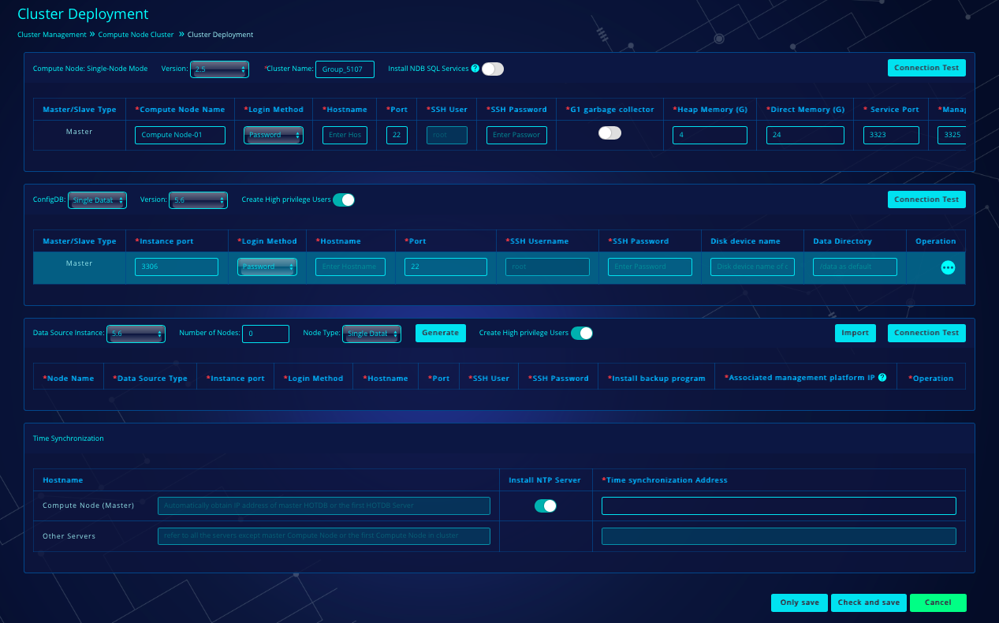

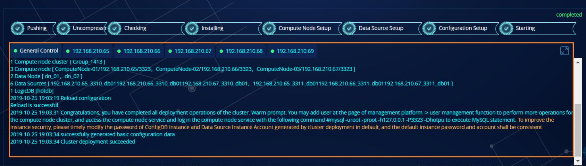

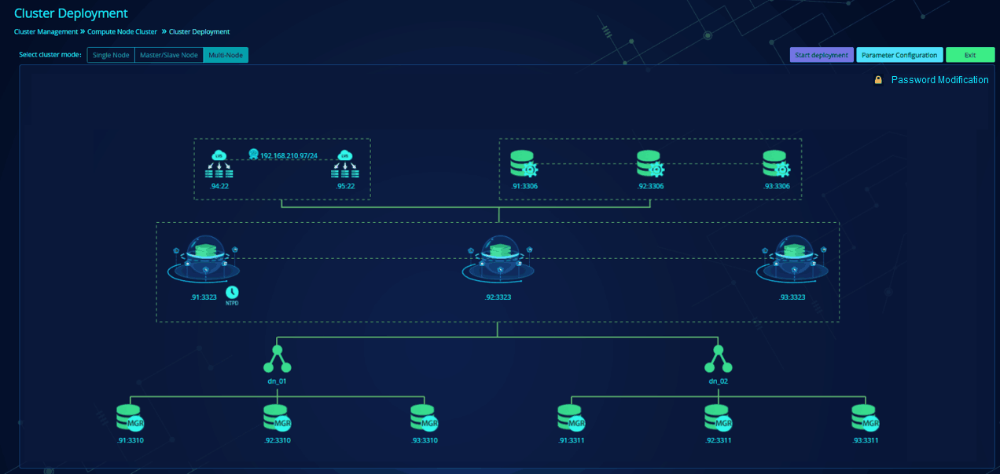

##### Single Component Deployment

Single component deployment can add data source instances or other required components to the deployed distributed transactional database cluster, and can realize the relation building and service startup of new components.

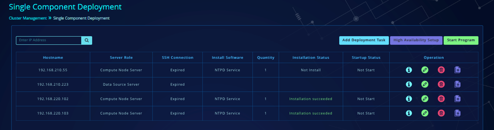

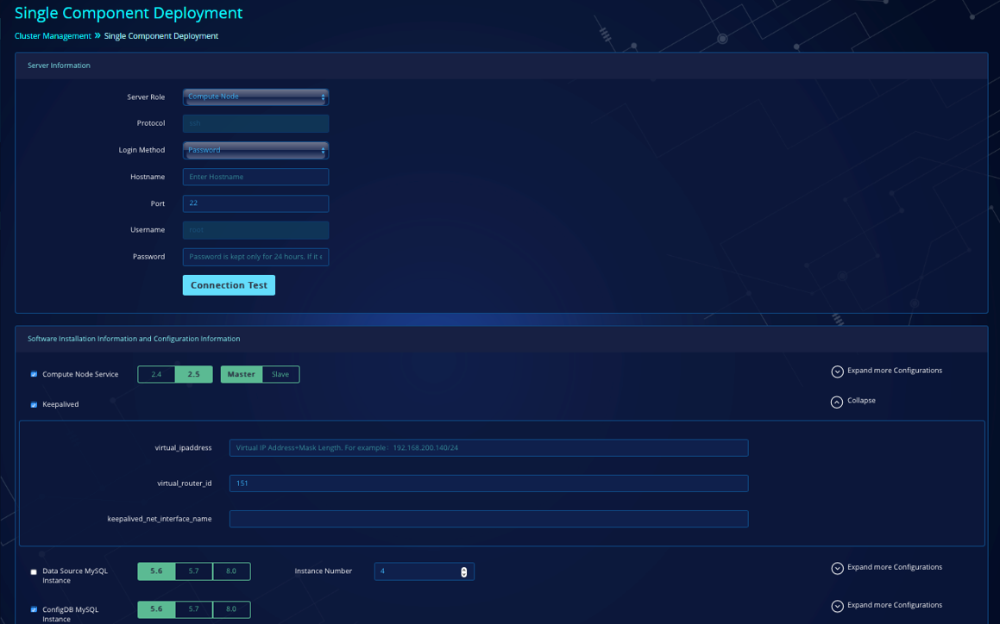

##### Online upgrade

Online upgrade supports online version upgrade of HotDB Server through management platform, including upgrades of cross version or small version for single node, active/standby nodes, and multi-node cluster mode, it also provides users with automatic rollback mechanism in case of exception during the upgrade. The program tries to ensure that the cluster is rolled back to the state before the upgrade to reduce the impact on online business.

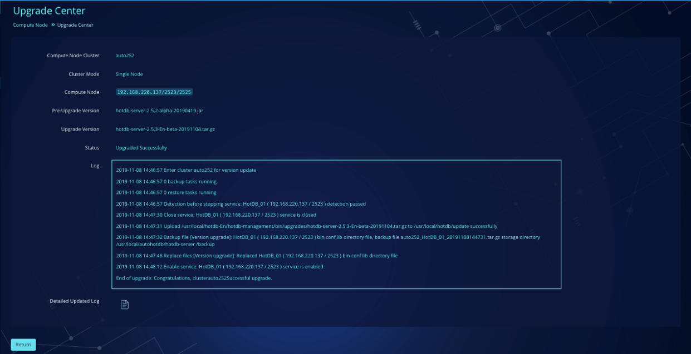

### Deployment environment examination

Deployment environment examination is a set of examination and scoring function tailor-made for HotDB Server cluster. This function can be used to evaluate the running environment of the cluster, whether it is a cluster deployed through manual installation or management platform installation. After the evaluation, it will display the examination results of nearly 140 items in the five dimensions of the whole cluster, to provide more comprehensive standard reference information for the optimization of cluster running environment.

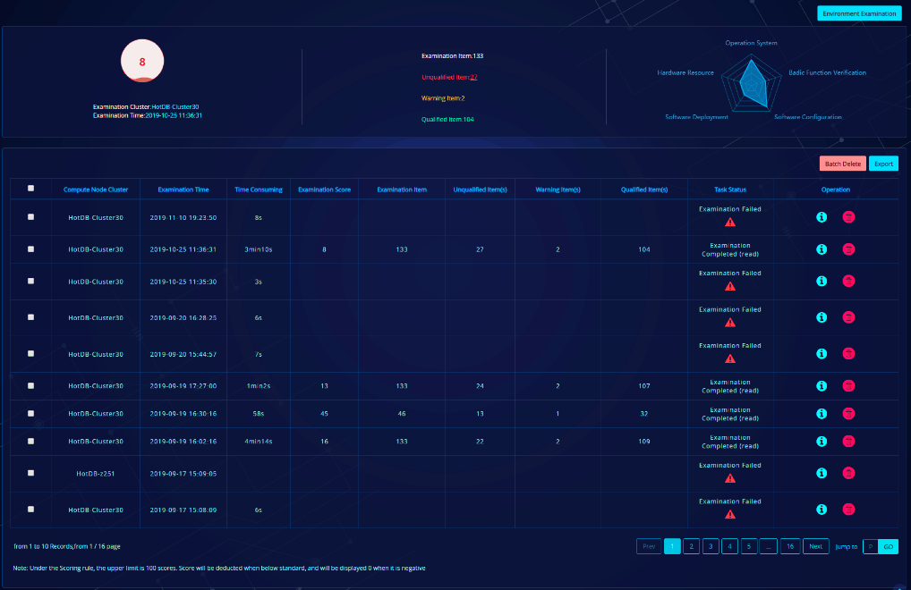

### Information collection

HotDB Server has many cluster components and complex running mechanism, thus it will be difficult to analyze and troubleshoot the abnormality or failure with incomplete information. With information tool, the required log and configuration file information can be quickly collected and analyzed when problems occur, so as to improve the speed and efficiency of troubleshooting.

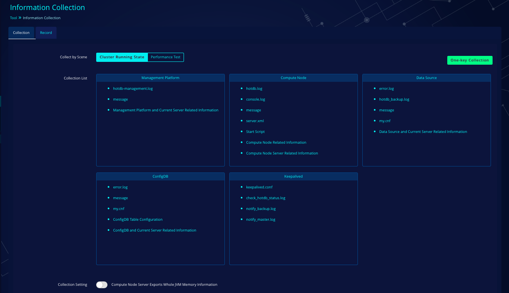

### License management

The management platform supports online update or activation of compute node licenses. It can provide functional support for various scenarios such as trial license activated as official license, trial license update, official license update, and first license activation.

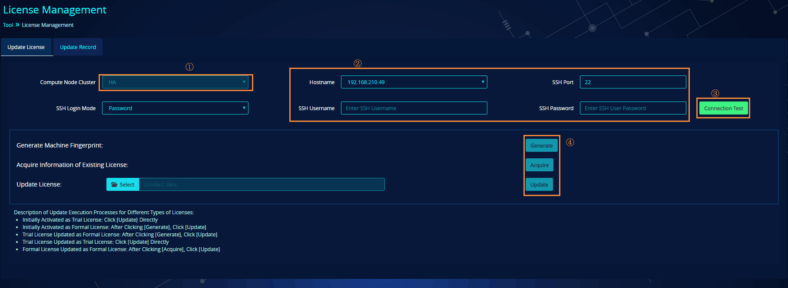

### Network awareness

The compute node supports the regular detection of the network quality from the compute node to the server where data sources and ConfigDBs are located in the cluster. Record the links that do not conform to the network quality into the ConfigDB and logs and display it on the management platform, so as to facilitate the user to troubleshoot the abnormal operation or failure of the cluster caused by network problems.

### Intelligent inspection

It supports the visualized periodical inspection of the running status of the compute node cluster to avoid the online hidden trouble in time.

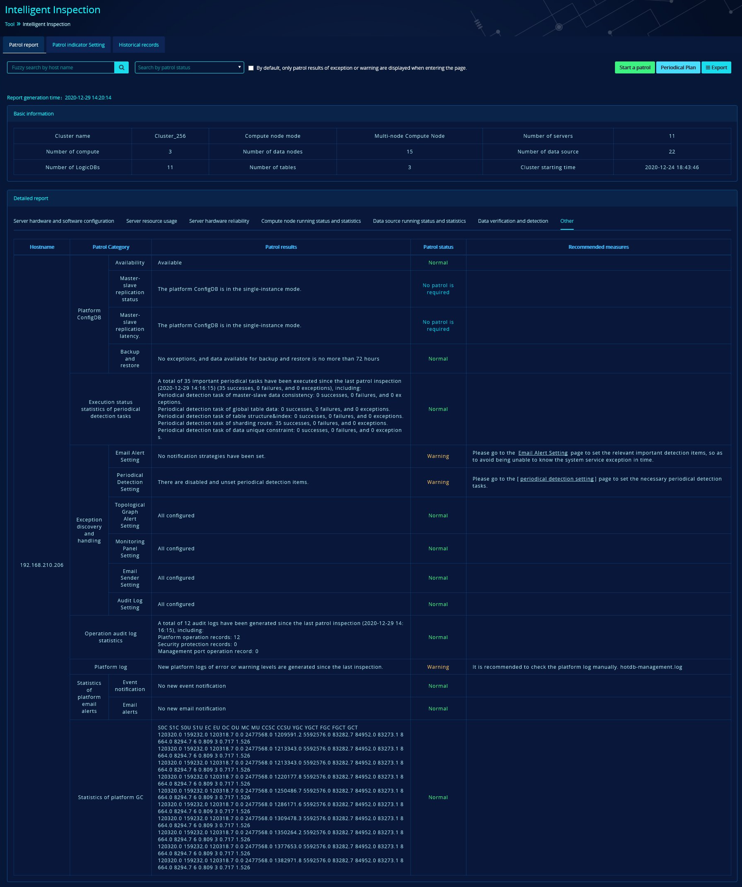

## Database security control

It supports the use of SSL+SM4 authentication to log in to the compute node.

## Others

HotDB Server supports many other functions: querying the data in the specified data node through DNID (DATANODE_ID); read/write splitting; configuring the read/write ratio of the master-slave data source; automatically dividing the read ratio under multiple slave data sources; manage the connection of HotDB Server service port through the third-party database management tool.

### DNID

DNID stands for DATANODE_ID. You can use the DNID-related syntax in hint to control the nodes distributed by SQL (be careful when using, and pay attention to the relevant precautions). In SELECT query statements, you can also use DNID as a filter condition in the WHERE clause and as a query item in the SELECT clause. Session variable can be used to control whether the DNID of results of each row is displayed in the result set.

### Read/write splitting

- HotDB Server supports read/write splitting function and supports configuration of read/write splitting weight. This function is off by default and can be configured with multiple modes.

- The read/write are all in the master data source, that is, the read/write splitting is turned off.

- The separable read requests are sent to all available data sources (including the master data source).

- The separable read requests are sent to all available slave data sources.

Note: the above \"separable read requests\" mainly refers to the automatically submitted read requests without hint and the requests in the explicit read-only transactions. The remaining read requests without hint are \"inseparable read requests\".

- The read requests before write and the automatically submitted read requests in the transaction (non XA mode) are sent to the available slave data sources. The remaining requests are on the master data source.

- When the data synchronization delay of the data source exceeds 1 second (configurable) or failure occurs, the compute node will remove the data source and prevent it from participating in the read. At this time, other normal data sources will undertake the separable read task, and the removed data sources will not be added back to the read cluster until the delay is recovered.

- HotDB Server read/write splitting is completely transparent to application developers and database managers. It does not require developers to add hint or some notes when executing SQL and supports the use of hint to explicitly specify reading master or slave.

### Third-party client

HotDB Server supports Navicat, Workbench and other third-party tools for database management.

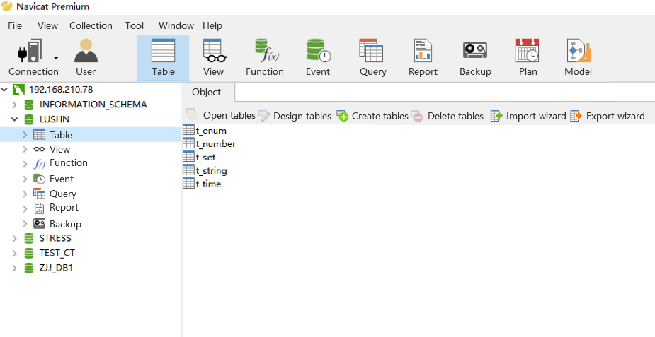

Diagram of Navicat Connecting to HotDB Server Data Service Port

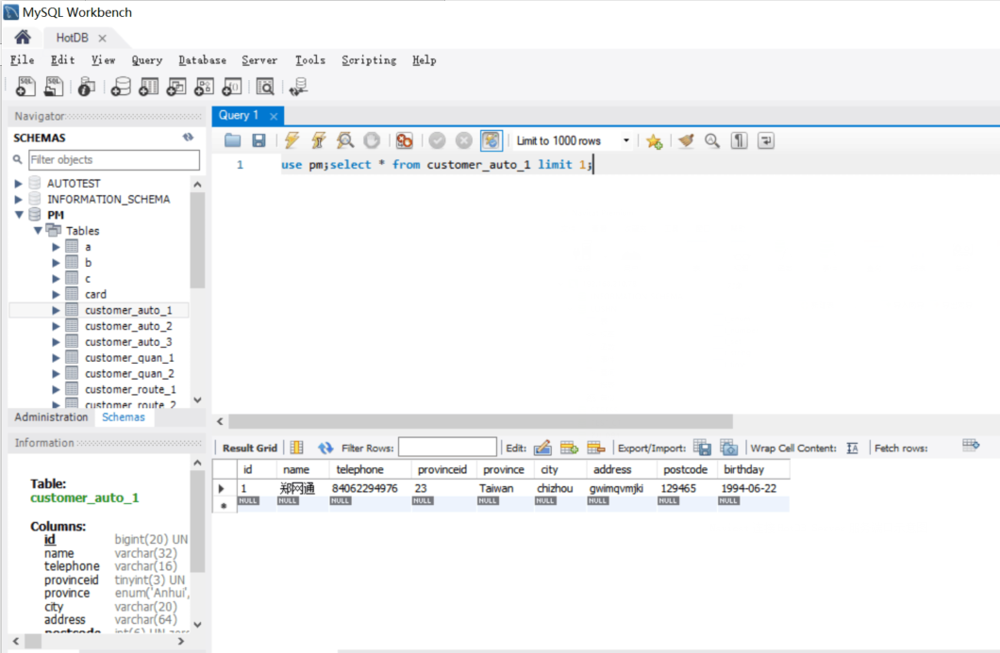

Diagram of Workbench Connecting to HotDB Server Data Service Port

### Product internationalization

HotDB Server products and supporting management platform support both Chinese and English language modes, and can switch online according to the actual requirements of users. In addition, we provide the product function manual in English to help the overseas users to use the product.

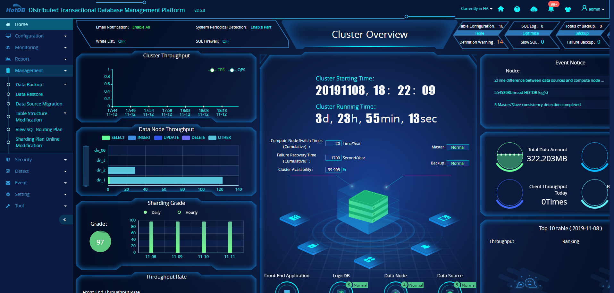

# HotDB Server Deployment and Configuration

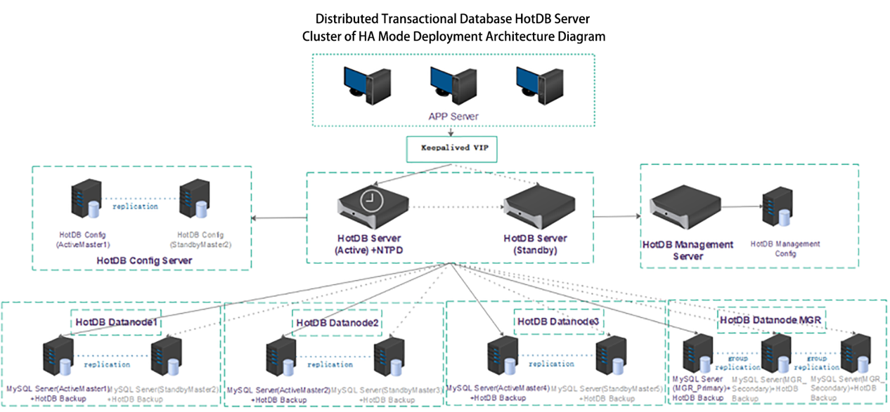

Cluster of HA Mode Deployment Architecture Diagram

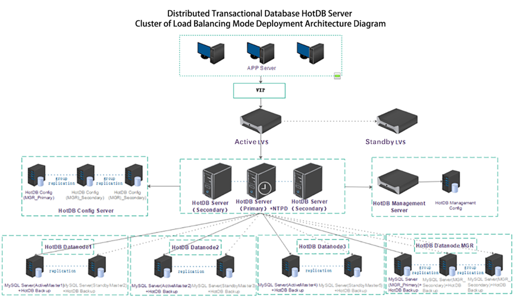

Cluster of Load Balancing Mode Deployment Architecture Diagram

## Configuration recommendation

### Compute node server (and compute node ConfigDB)

Processor: Gold 6130\*2

Memory: 8g\*12 (4G \* 12 is recommended if there is a single 4G memory)

Hard disk: 2.5\'800G write-intensive SATA\\SAS SSD \*2 RAID 1 (800G is selected because of longer write life)

RAID card: H730P

Network card: 10G optical network card

Number of servers: 2 (at least 3 and at most 9 in the cluster load balancing mode)

Note: in the cluster load balancing mode, it is recommended that the compute node ConfigDB occupy the server separately and do not share with the compute node or data source server. When compute node ConfigDB occupies server exclusively, please refer to \"management platform ConfigDB server\" for configuration.

### Data source server

Processor: Silver 4116\*2

Memory: 16G\*12

Hard disk: 2.5\' 2.4T 10K SAS HDD \*2 RAID 1 (for system and backup file storage)

\+ 2.5\' 800G write-intensive SATA\\SAS SSD \*6 RAID 5 (for MySQL)

RAID card: H730P

Network card: Gigabit optical network card

Number of servers: at least 2 (add as needed)

### Management platform server

Processor: Silver 4108\*2

Memory: 8G\*12 (4G\*12 is recommended if there is a single 4G memory)

Hard disk: 2.5\' 240G SATA SSD \*2 RAID 1

RAID card: H330

Network card: Onboard Gigabit

Number of servers: 1 or reused

### Management platform ConfigDB server

Processor: Silver 4110\*2

Memory: 8G\*12 (4G\*12 is recommended if there is a single 4G memory)

Hard disk: 2.5 \'400G write-intensive SATA\\SAS SSD \*2 RAID 1

RAID card: H730P

Network card: Gigabit optical network card

Number of servers: 1 or reused

### LVS server (cluster load balancing mode)

Processor: Silver 4116\*2

Memory: 8G\*12 (4G\*12 is recommended if there is a single 4G memory)

Hard disk: 2.5\' 240G SATA SSD \*2 RAID 1

RAID card: H330

Network card: 10 Gigabit network card

Number of servers: 2

### Switch

- It is recommended that the switch interface speed and the network card interface speed configured by the server are the same or higher.

- It is recommended to use a switch with convergence level or higher performance level, and the measured packet forwarding rate of the switch exceeds 10 Mpps or supports line speed forwarding.

- It is recommended that all servers should be deployed under the same switch (or stack). If this is not possible, the deployment mode of minimum network hops should be adopted.

Note: it is not recommended that the network traffic of the cluster pass through any router or firewall.

- If a highly available network is deployed, it is recommended to use Bond0 mode first.

Note: in the process of performance test, in addition to the server performance index, we must pay attention to whether the switch loses packets. The actual pps performance of many switches is far lower than the nominal index.

### Special instructions

- The above configurations take DELL server as an example. For other computer manufacturers, you can select the same configuration.

- The number of MySQL database servers is evaluated based on the TPS / QPS of the production environment or performance test. The single data source server described can make the master/slave latency within 1 second and stably support the operation in the production environment with TPS of 4000-6000, and QPS of 15000 around when the master/slave latency within 1 second.

Note: if the above scenario is read-based, the QPS will be higher; here TPS refers to simple TPS, and complex TPS needs to be measured to get specific data.

Special instructions: in the performance test environment, MySQL server can usually get higher value than the description, however along with problems such as serious master/slave latency, abnormally long time of SQL response, or response time/throughput jitter, for performance pressure measurement generally does not control the specific flow, but the number of concurrency; enough concurrency can squeeze the performance of MySQL instances to the limit. However, although the throughput is large, the overall QoS (Quality of Service) in this limit state is very poor. Thus, the performance indicators in this limit state are not suitable for evaluating the production environment. When planning the production environment, it is recommended to take the smaller value of 50% of the throughput index and 80% of the replication catch-up speed, which can get better QoS.

- Performance test with at least two database servers, four pairs of mysqld instances, and master-master replication cross deployment can test scenarios with TPS of more than 40,000 and QPS of more than 100,000.

Note: under this pressure, MySQL replication delay and poor SQL response time generally occur, which is normal. The performance test index obtained by this test method is significant for evaluating the upper throughput capacity supported by HotDB server compute nodes, but is not suitable for evaluating data source throughput.

- The deployment recommendation above is for test environments (including pressure test environment) of HA or cluster load balancing architecture. For the actual production environment configuration, you need to contact Hotpu technology for specific assessments.

# Cases

After years of grinding and overcoming difficulties, HotDB Server has built a good reputation in industries such as finance, communication, logistics, media, and retail, and helped many clients apply distributed transactional database successfully. HotDB Server has solved "two-large and three-high" (namely large-scale user, large-scale data, high availability, high concurrency and high throughput) problems in traditional architecture. Here are some typical cases.

## Shanghai YTO Express (Logistics) Co., Ltd.

**Industry:** logistics

**Project:** Transformation of Jingang Core System

**Case profile:**

YTO Express\'s original Jingang core system went down when its capacity peaked at 6.5 million units / day. After being transformed into the distributed transactional database, it successfully supported 13.5 million units / day in 2013, 23 million units / day in 2014, 53 million units / day in 2015 and 89 million units / day in 2016. The core components of Jingang system, namely high-end minicomputer, high-end storage device, WAS middleware and Oracle database are transformed into a distributed architecture composed of X86 server, JBOSS middleware, Redis, distributed transactional database HotDB Server and Hadoop big data platform, which supports the rapid growth of business volume.

## The People\'s Bank of China（PBC）

**Industry:** finance

**Project:** Credit Reference Center of PBC

**Case profile:**

Focusing on the technical requirements of MySQL database of credit reference center of PBC, from multiple dimensions such as the distributed transactional database architecture design, data sharding design, data architecture governance principles, installation and deployment of MySQL database, standard initialization, operating system customization, development specification, monitoring and alarm customization, configuration specification, data migration, performance optimization, parameter optimization, high availability design, and R&D support, HotDB Server guarantees the stability, reliability and efficiency of MySQL database service of the business system, and establish a MySQL database operation and maintenance management system in line with the features of credit reference center. It has realized the monitoring of six data centers, more than 8000 physical servers and more than 3 million monitoring items. Moreover, it breaks through the NVPS bottleneck of Zabbix monitoring software and improves the data processing efficiency and throughput of Zabbix.

## China UnionPay Merchant Services Co., Ltd. （ China UMS）

**Industry:** finance

**Project:** Distributed tTansactional Database Transformation of China UMS System

**Case profile:**

The transformation of BBS system, internal management and office system, open API system, etc. are in the early stage of distributed transactional database transformation, after the distributed transactional database HotDB Server is introduced into China UMS. Based on the features of China UMS system, Hotpu technology provides solutions such as distributed transactional database architecture design, data sharding design, data architecture governance principles, and database installation and deployment. Besides, HotDB Server distributed transactional database provides functions such as complete high availability solutions, read/write splitting, DR backup, monitoring and alarm, to help China UMS successfully migrate data from heterogeneous databases and establish MySQL operation and maintenance system.

## China Development Bank (CDB)

**Industry:** finance

**Project:** Distributed Transactional Database Transformation of CDB Student Loan System

**Case profile:**

The original student loan system of China Development Bank cannot undertake the high concurrency and high throughput at the beginning of the school year. Therefore, the domestic-developed HotDB Server is introduced. Through multiple rounds of testing, it appears that HotDB Server can ensure strong consistency of distributed transactions, strong consistency of master/slave data under abnormal scenarios, strong consistency of backup, data service stability, intelligent operation and maintenance platform, etc., and ensure the stable operation of the whole system, supports data access of TB-PB level, high concurrency, and high throughput, and greatly improve the ability of serving massive users and processing massive data.

